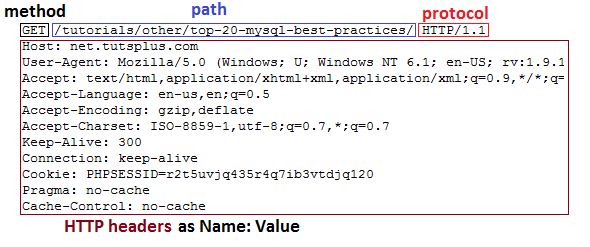

# Conceptual Questions
* Deep Copy vs Shallow Copy?  
Shallow Copy:  
  - The variables A and B refer to different areas of memory, when B
is assigned to A the two variables refer to the same area of memory. Later 
modifications to the contents of either are instantly reflected in the contents 
of other, as they share contents.   

  Deep Copy:  
  - Deep copies duplicate everything. A deep copy of a collection is two 
collections with all of the elements in the original collection duplicated.

* HashTable vs HashMap? How to design hash table?  
in java, hash table is synchronized and hash map is not synchronized
## C++ Questions
* Virtual function? Pure virtual function?
* Overloading vs Overriding

## Golang Questions
* Implment a timer in golang  

```go  
// One way to do it  
import "time"
import "fmt"
func main {
timer1 := time.NewTimer(2 * time.Second)
    <-timer1.C
    fmt.Println("Timer 1 expired")

    timer2 := time.NewTimer(time.Second)
    go func() {
        <-timer2.C
        fmt.Println("Timer 2 expired")
    }()
    stop2 := timer2.Stop()
    if stop2 {
        fmt.Println("Timer 2 stopped")
    }
}
```

## Computer Networks Questions
* Session vs Cookie  
Cookies and Sessions are used to store information. Cookies are only stored on 
the client-side machine, while sessions get stored on the client as well as a 
server.  
Session  
A session creates a file in a temporary directory on the server where registered
session variables and their values are stored. This data will be available to 
all pages on the site during that visit.  
A session ends when the user closes the browser or after leaving the site, the 
server will terminate the session after a predetermined period of time, commonly
30 minutes duration.  
Cookies  
Cookies are text files stored on the client computer and they are kept of use 
tracking purpose. Server script sends a set of cookies to the browser. For 
example name, age, or identification number etc. The browser stores this 
information on a local machine for future use.
When next time browser sends any request to web server then it sends those 
cookies information to the server and server uses that information to identify 
the user.
Website:  
If an HTTP request does not have a “cookie” field, include a “set-cookie” header
line in HTTP response message  
Storing in back-end database the cookie with info about the user’s requests  
Browser:  
Save all received cookies in a local cookie file  
When visiting a webpage: if a match cookie found, include it in “cookie” header 
line in HTTP request  

* HTTP(HyperText Transfer Protocol) multiplexing多路复用, how it works? Http vs 
Https? How does HTTP header works?  
Head of ling blocking since http1.0 and http1.1 has sequential order of request 
handling  
Pipelining: client sends requests as soon as it sees a referenced object  
Multiplexing: only one TCP connection is needed between client and server and 
the connection can carry multiple streams  
Common Method: 
GET, POST, DELETE, PUT  
Common Status Code:  
 - 200 OK(request succeeded, requested object later in this message)  
 - 301 Moved Permanently(requested object moved, new location specified later 
in this message (Location:))  
 - 400 Bad Request(request message not understood by server)  
 - 404 Not Found(requested document not found on this server)  
 - 505 Http Version Not Supported  

 HTTP Header  


 Hypertext Transfer Protocol Secure(HTTPS):  
 - Transport Layer Secure(TLS)
 - Secure Sockets Layer(SSL)  
It allows the secure transactions by encrypting the entire communication with 
SSL. It is a combination of SSL/TLS protocol and HTTP. It provides encrypted and
secure identification of a network server.
sites with Domain Validation Certificates

* TCP vs UDP? What is 3-way handshake? What is 4-way handshake? Why?
* How to guarantee TCP transmission reliability?
* TCP congestion control mechanism? Does UDP have congestion control?

* What Internet Protocols for video chat?  
VoIP/RTSP/WebRTC/SIP, TCP/UDP, 
Stream description SDP, SMIL...
Describe the session and content
 Stream control RTSP
Remote control the session
 Media transport RTP
Error control and flow control
 Resource reservation (if any!): RSVP, DiffServ
provide QoS for media streaming packets

* ARP broadcasting, how does it work? internet storm => how to solve?

* URL to webpage loading, what is the entire process?  
  1. enter the url to the address bar
  2. a request will be sent to the DNS server based on your network 
  configuration
  3. DNS will route you to the real IP of the domain name
  4. a request(with complete Http header) will be sent to the server(with 3's IP
  to identify)'s 80 port(suppose we don't specify another port)
  5. server will search the listening ports and forward the request to the app 
  which is listening to 80 port(let's say nginx here) or to another server(then 
  3's server will be like a load balancer)
  6. nginx will try to match the url to its configuration and serve as an static
  page directly, or invoke the corresponding script intepreter(e.g PHP/Python) 
  or other app to get the dynamic content(with DB query, or other logics)
  7. a html will be sent back to browser with a complete Http response header
  8. browser will parse the DOM of html using its parser
external resources(JS/CSS/images/flash/videos..) will be requested in sequence(or not?)
For JS, it will be executed by JS engine. For CSS, it will be rendered by CSS 
engine. HTML's display will be adjusted based on the CSS(also in sequence or not?)
If there's an iframe in the DOM, then a separate same process will be executed 
from step 1-12

* What is Content Delivery Network(CDN)?  
CDN is a system of distributed servers (network) that deliver pages and other 
Web content to a user, based on the geographic locations of the user, the origin
of the webpage and the content delivery server.
This service is effective in speeding the delivery of content of websites with 
high traffic and websites that have global reach. The closer the CDN server is 
to the user geographically, the faster the content will be delivered to the user
. CDNs also provide protection from large surges in traffic.
## Operating System Questions
* Process vs threads? Interprocess communication and synchronization techniques?  
IPC:
  - Message Passing 消息传递（管道、FIFO、消息队列）
  - Shared Memory 共享内存（匿名的和具名的）
  - Remote Procedure Call 远程过程调用（Solaris门和Sun RPC）
Synchronization: 
  - Mutex 互斥量
  - Smaphore 信号量
  - 条件变量
  - 读写锁、文件和写记录锁、信号量）

* Conditions of deadlock?

* Block IO, Nonbloack IO, Asynchronous IO? epoll is what?
* which system calss for process creating?
* Garbage Collection how it works?
* How does the OS which process is running and which is not running?
* Describe address space layout in memory


## Computer Security Questions
## Database System Questions
* Relationanl database vs nonrelational database?  
Relationnal Database:  
A relational database is a digital database based on the relational model of 
data. 
The data is stored in tables containing rows (which represents an entry) and 
columns(which stores and sorts a specific type of information). Relationships 
are established through Primary and Foreign keys.  
Nonrealtional Database:  
Great at storing large amounts of data with little structure.  

* ACID of database system?  
  - Atomicity(原子性): 一个事务（transaction）中的所有操作，或者全部完成，或者全部不完成，不会结束在中间某个环节。事务在执行过程中发生错误，会被回滚（Rollback）到事务开始前的状态，就像这个事务从来没有执行过一样。即，事务不可分割、不可约简  
  - Consistency(一致性): 在事务开始之前和事务结束以后，数据库的完整性没有被破坏。这表示写入的资料必须完全符合所有的预设约束、触发器、级联回滚等。  
  - Isolation(隔离性): 数据库允许多个并发事务同时对其数据进行读写和修改的能力，隔离性可以防止多个事务并发执行时由于交叉执行而导致数据的不一致。事务隔离分为不同级别，包括读未提交（Read uncommitted）、读提交（read committed）、可重复读（repeatable read）和串行化（Serializable）。  
  - Duration(持久性): 事务处理结束后，对数据的修改就是永久的，即便系统故障也不会丢失

## Software Engineering Questions
* Design Pattern? Give some examples.  
 - Singleton Pattern  
The Singleton pattern ensures that a class has only one instance and provides a 
global point of access to that instance. It is named after the singleton set, 
which is defined to be a set containing one element. This is useful when exactly
one object is needed to coordinate actions across the system.

 ```c++
 class StringSingleton
 {
 public:
     // Some accessor functions for the class, itself
     std::string GetString() const 
     {return mString;}
     void SetString(const std::string &newStr)
     {mString = newStr;}
  
     // The magic function, which allows access to the class from anywhere
     // To get the value of the instance of the class, call:
     //     StringSingleton::Instance().GetString();
     static StringSingleton &Instance()
     {
         // This line only runs once, thus creating the only instance in existence
         static std::auto_ptr<StringSingleton> instance( new StringSingleton );
         // dereferencing the variable here, saves the caller from having to use
         // the arrow operator, and removes temptation to try and delete the 
         // returned instance.
         return *instance; // always returns the same instance
     }
  
 private: 
     // make some given functions private to finish the definition of the singleton
	 // default constructor available only to members or friends of this class
	 StringSingleton(){} 

     // Note that the next two functions are not given bodies, thus any attempt 
     // to call them implicitly will return as compiler errors. This prevents 
     // accidental copying of the only instance of the class.
     StringSingleton(const StringSingleton &old); // disallow copy constructor
     const StringSingleton &operator=(const StringSingleton &old); //disallow assignment operator
  
     // Note that although this should be allowed, 
     // some compilers may not implement private destructors
     // This prevents others from deleting our one single instance, which was
	 // otherwise created on the heap
     ~StringSingleton(){} 
 private: // private data for an instance of this class
     std::string mString;
 };
 ```
 - Factory Pattern   
A utility class that creates an instance of several families of classes. 
It can also return a factory for a certain group. The Factory Design Pattern is 
useful in a situation that requires the creation of many different types of 
objects, all derived from a common base type. The Factory Method defines a 
method for creating the objects, which subclasses can then override to specify 
the derived type that will be created. Thus, at run time, the Factory Method can
be passed a description of a desired object (e.g., a string read from user input
) and return a base class pointer to a new instance of that object. The pattern 
works best when a well-designed interface is used for the base class, so there 
is no need to cast the returned object. 

 ```c++
 class Computer
 {
 public:
     virtual void Run() = 0;
     virtual void Stop() = 0;
      
     virtual ~Computer() {}; 
     /* without this, you do not call Laptop or Desktop destructor in this example! */
 };
 
 class Laptop: public Computer
 {
 public:
     void Run() override {mHibernating = false;}; 
     void Stop() override {mHibernating = true;}; 
     virtual ~Laptop() {};
 	/* because we have virtual functions, we need virtual destructor */
 private:
     bool mHibernating; // Whether or not the machine is hibernating
 };
 
 class Desktop: public Computer
 {
 public:
     void Run() override {mOn = true;}; 
     void Stop() override {mOn = false;}; 
     virtual ~Desktop() {};
 private:
     bool mOn; // Whether or not the machine has been turned on
 };
 
 class ComputerFactory
 {
 public:
     static Computer *NewComputer(const std::string &description)
     {
         if(description == "laptop")
             return new Laptop;
         if(description == "desktop")
             return new Desktop;
         return nullptr;
     }
 };
 ```
 - MVC Pattern  
* What is Object Oriented Programming(OOP)?  
OOP is a programming language model in which programs are organized around data,
or objects, rather than functions and logic.  
Four Principles:  
  - Encapsulation  
  - Abtraction  
  - Inheritance  
  - Polymorphism  


# Coding Questions
1. The longest path of binary tree
2. Mirror a binary tree
3. Longest Common Substring
4. Check out common sorting algorithms, quick sort
5. Delete repeated elements in a single linked list
6. How to check prime number
7. How to check loop in linked list
8. Convert BST to circular doubly linked list  

```c++
TreeNode* prev;
TreeNode* head;
TreeNode* bstToSortedDll(TreeNode* root) {
    TreeNode* head = NULL;
    if (root == NULL) {
        return NULL;
    }
    bstToSortedDll(root->left);
    root->left = prev;
    if (prev != NULL) {
        prev->right = root;
    } else {
        head = root;
    }
    prev = root;

    TreeNode* right = root->right;
    // two lines below for the formation of circle
    head->left = root;
    root->right = head;

    bstToSortedDll(right);
}
```
